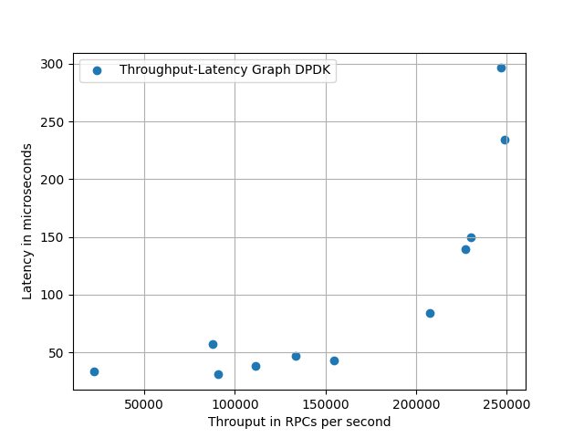
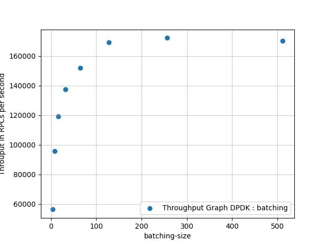
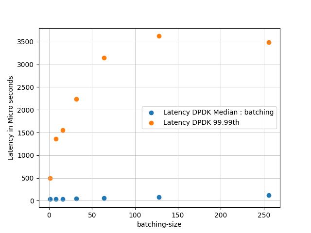

# sRPC
- A simple to use but high performance RPC framework in development.
- Kernel Bypass using DPDK.
- A handy compiler which translates RPC contract to C++ code to ease develpoment.
- Undergoing optinmisation.
- Thesis Project under [Dr. Shuai Mu](http://mpaxos.com)

- stats DPDK:
 ```time: 100.000072, count: 10667610, rpc per sec: 106676.023326```

 - stats TCP:
 ```time: 100.000106, count: 1278520, rpc per sec: 12785.186456```
- Throuput latency graph:



- Other figures:






